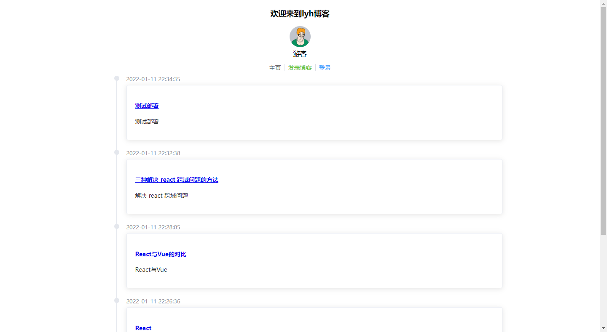
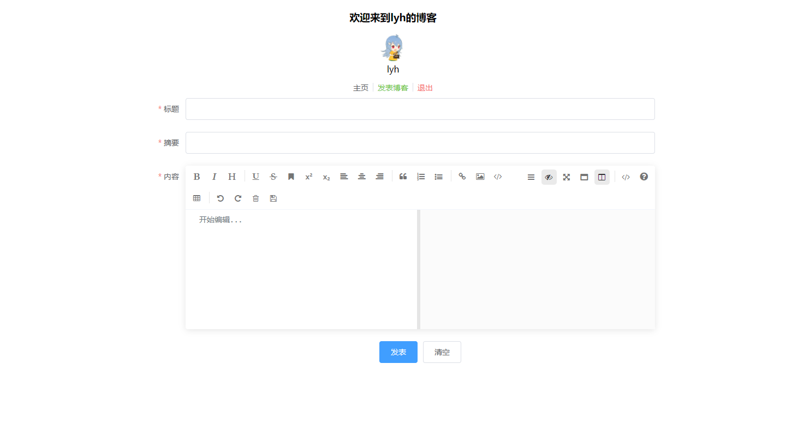

# 基于Spring Boot的博客系统

## 简介

前后端分离的博客项目

## 技术栈

前端：Vue、Element-UI、Axios

后端：Spring Boot、MyBatis Plus、Shiro、Redis、Hibernate Validator、JWT

## 后端接口开发

Spring Boot未来易于扩展，适合微服务体系，因此选择Spring Boot作为框架的基础。

MyBatis Plus只需要简单的配置，就可以进行快速的CRUD操作，从而节省大量的时间。

Shiro配置简单，使用也简单，因此选择使用Shiro来进行权限控制。

考虑到项目可能需要部署在多台服务器上，这时候我们要共享会话信息，Redis是现在主流的缓存中间件，也适合我们的项目。

最后，我们使用JWT来进行用户身份认证。

后端用到的技术：

- Spring Boot
- MyBatis Plus
- Shiro
- Lombok
- Redis
- Hibernate Validator
- JWT
- ……

### 登录接口

```java
@RestController
public class AccountController {

    @Resource
    private UserService userService;
    @Resource
    private JwtUtils jwtUtils;

    @PostMapping("/login")
    public Result login(@Validated @RequestBody LoginDto loginDto, HttpServletResponse response) {
        User user = userService.getOne(new QueryWrapper<User>().eq("username", loginDto.getUsername()));
        Assert.notNull(user, "用户不存在");
        if (!user.getPassword().equals(SecureUtil.md5(loginDto.getPassword()))) {
            return Result.error("密码错误");
        }
        String token = jwtUtils.generateToken(user.getId());
        response.setHeader("Authorization", token);
        response.setHeader("Access-control-Expose-Headers", "Authorization");
        return Result.success(MapUtil.builder()
                .put("id", user.getId())
                .put("username", user.getUsername())
                .put("avatar", user.getAvatar())
                .put("email", user.getEmail())
                .map()
        );
    }

    @RequiresAuthentication
    @GetMapping("/logout")
    public Result logout() {
        SecurityUtils.getSubject().logout();
        return Result.success(null);
    }
}
```

### 博客接口

```java
@RestController
@RequestMapping("/blog")
public class BlogController {
    @Resource
    private BlogService blogService;

    @GetMapping("/blogs")
    public Result list(@RequestParam(defaultValue = "1") Integer currentPage,
                       @RequestParam(defaultValue = "5") Integer pageSize
    ) {
        Page<Blog> page = new Page<>(currentPage, pageSize);
        IPage<Blog> pageData = blogService.page(page, new QueryWrapper<Blog>().orderByDesc("created"));
        return Result.success(pageData);
    }

    @GetMapping("/{id}")
    public Result detail(@PathVariable(name = "id") Long id) {
        Blog blog = blogService.getById(id);
        Assert.notNull(blog, "文章不存在");
        return Result.success(blog);
    }

    @RequiresAuthentication
    @PostMapping("/addOrEdit")
    public Result addOrEdit(@Validated @RequestBody Blog blog) {
        Blog temp;
        if (blog.getId() != null) {
            temp = blogService.getById(blog.getId());
            // 只能编辑自己的文章
            Assert.isTrue(temp.getUserId().longValue() == ShiroUtils.getAccountProfile().getId().longValue(), "没有权限编辑");
        } else {
            temp = new Blog();
            temp.setUserId(ShiroUtils.getAccountProfile().getId());
            temp.setCreated(LocalDateTime.now());
            temp.setStatus(0);
        }
        BeanUtils.copyProperties(blog, temp, "id", "userId", "created", "status");
        blogService.saveOrUpdate(temp);
        return Result.success(null);
    }
}
```

## 前端页面开发

前端用到的技术：

- Vue
- Element-UI
- Axios
- mavon-editor
- markdown-it
- github-markdown-css

### 页面路由

- BlogDetail.vue（博客详情页面）
- BlogEdit.vue（编辑博客）
- Blogs.vue（博客列表）
- Login.vue（登录页面）

```vue
import Vue from 'vue'
import VueRouter from 'vue-router'

Vue.use(VueRouter)

const routes = [
  {
    path: '/',
    name: 'Index',
    redirect: {name: 'Blogs'}
  },
  {
    path: '/blogs',
    name: 'Blogs',
    component: () => import(/* webpackChunkName: "about" */ '../views/Blogs.vue')
  },
  {
    path: '/login',
    name: 'Login',
    component: () => import(/* webpackChunkName: "about" */ '../views/Login.vue')
  },
  {
    path: '/blog/add',
    name: 'BlogAdd',
    component: () => import(/* webpackChunkName: "about" */ '../views/BlogEdit.vue')
  },
  {
    path: '/blog/:blogId',
    name: 'BlogDetail',
    component: () => import(/* webpackChunkName: "about" */ '../views/BlogDetail.vue')
  },
  {
    path: '/blog/:blogId/edit',
    name: 'BlogEdit',
    component: () => import(/* webpackChunkName: "about" */ '../views/BlogEdit.vue')
  }
]

const router = new VueRouter({
  mode: 'history',
  base: process.env.BASE_URL,
  routes
})

export default router

```

### 登录页面

```vue
<template>
<div>
  <el-container>
    <el-header>
      
    </el-header>
    <el-main>
      <el-form :model="ruleForm" :rules="rules" ref="ruleForm" label-width="100px" class="demo-ruleForm">
        <el-form-item label="用户名" prop="username">
          <el-input v-model="ruleForm.username"></el-input>
        </el-form-item>
        <el-form-item label="密码" prop="password">
          <el-input type="password" v-model="ruleForm.password"></el-input>
        </el-form-item>
        <el-form-item>
          <el-button type="primary" @click="submitForm('ruleForm')">登录</el-button>
          <el-button @click="resetForm('ruleForm')">清空</el-button>
        </el-form-item>
      </el-form>
    </el-main>
  </el-container>
</div>
</template>
```

### 公共组件Header

```vue
<template>
<div class="content">
  <h3>欢迎来到{{user.username}}的博客</h3>
  <div class="block">
    <el-avatar :size="50" :src="user.avatar"></el-avatar>
    <div>{{user.username}}</div>
  </div>
  <div class="link">
    <span><el-link href="/blogs">主页</el-link></span>
    <el-divider direction="vertical"></el-divider>
    <span><el-link type="success" href="/blog/add">发表博客</el-link></span>
    <el-divider direction="vertical"></el-divider>
    <span v-if="!isLogin"><el-link type="primary" href="/login">登录</el-link></span>
    <span v-if="isLogin"><el-link type="danger" @click="logout">退出</el-link></span>
  </div>
</div>
</template>
```

### 博客列表

```vue
<template>
<div>
  <Header></Header>
  <div class="block">
    <el-timeline>
        <el-timeline-item :timestamp="blog.created" placement="top" v-for="(blog, index) in blogs" :key="index">
          <el-card>
            <h4>
              <router-link :to="{name: 'BlogDetail', params: {blogId: blog.id}}">
                {{blog.title}}
              </router-link>
            </h4>
            <p>{{blog.description}}</p>
          </el-card>
        </el-timeline-item>
      </el-timeline>
  </div>
  <el-pagination class="page"
                 background
                 layout="prev, pager, next"
                 :current-page="currentPage"
                 :page-size="pageSize"
                 :total="total"
                 @current-change="pageChange"
  >
  </el-pagination>
</div>
</template>
```

### 博客详情页面

```vue
<template>
<div>
  <Header></Header>
  <div class="blog">
    <el-link icon="el-icon-edit" v-if="isShowEditBtn">
      <router-link :to="{name: 'BlogEdit', params: {blogId: blog.id}}">
        编辑
      </router-link>
    </el-link>
    <div class="markdown-body" v-html="blog.content"></div>
  </div>
</div>
</template>
```

## 项目部署

Dockerfile

```dockerfile
FROM java:8

EXPOSE 8084

ADD spring_boot_blog-0.0.1-SNAPSHOT.jar app.jar
RUN bash -c 'touch /app.jar'

ENTRYPOINT ["java", "-jar", "/app.jar"]
```

docker-compose.yml

```yaml
version: '3'

services:
  nginx:
    image: nginx:latest
    ports:
    - 80: 80
    volumes:
    - /root/nginx/html:/usr/share/nginx/html
    - /root/nginx/nginx.conf:/etc/nginx/nginx.conf
    privileged: true
  mysql:
    image: mysql:5.7.27
    ports:
    - 3306:3306
    environment:
      - MYSQL_ROOT_PASSWORD=admin
  redis:
    image: redis:latest
  blog:
    image: blog:latest
    build: .
    ports:
    - 8084:8084
    depends_on:
      - mysql
      - redis
```

## 效果展示





